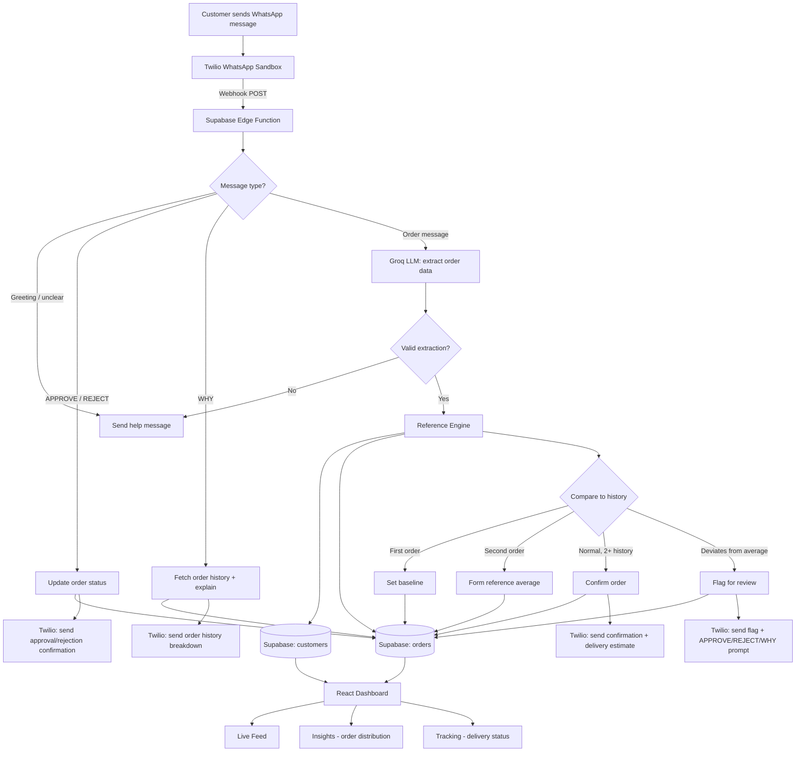

# Nudge AI

**AI-powered WhatsApp order anomaly detection — catches unusual orders before they become inventory mistakes.**

Businesses that take orders over WhatsApp have no easy way to spot when something looks off — a customer who usually orders 20 units suddenly ordering 200 shouldn't be processed silently. Nudge AI reads incoming WhatsApp order messages, compares them against that customer's own order history, and flags anything that deviates significantly — all before the order is ever confirmed.

Every anomaly is routed to a human for a final call. Nothing unusual gets through automatically, and normal orders are never held up.

---

## How it works

1. A customer messages an order on WhatsApp (e.g. *"Rahul wants 20 soap"*)
2. Nudge extracts the customer name, item, and quantity using an LLM
3. It compares the order against that customer's own history for that item
4. **Normal order** → confirmed instantly, with an estimated delivery date
5. **Unusual order** → flagged, and held for human approval or rejection — reply `APPROVE`, `REJECT`, or `WHY` to see the actual numbers behind the flag

---

## Use cases

**Wholesale distributors** — a soap/FMCG distributor taking daily WhatsApp orders from 50+ retail shops can't manually remember each shop's typical order size. Nudge catches a shop that usually orders 20 units suddenly ordering 200 — often the difference between a genuine bulk order and a typo, a duplicate message, or a compromised account.

**Local kirana/grocery suppliers** — small suppliers running their entire order pipeline through personal WhatsApp have no order history system at all today. Nudge gives them one for free, with zero behavior change required from their customers — orders are still just typed the same way they already are.

**Any recurring B2B order relationship** — office supply resellers, raw material suppliers to small manufacturers, or subscription-style bulk goods — anywhere a business takes repeat orders from the same set of customers over WhatsApp, and a mistaken or fraudulent order has real inventory or financial cost.

---

## Why this approach

**Most "AI order bots" attempt full automation** — accept the message, place the order, done. That's fast, but it means every LLM extraction error or genuine mistake ships straight to fulfillment with no check. Nudge is built around the opposite assumption: **the AI's job is to notice, not to decide.** Anomalies always stop at a human; normal orders are never held up waiting for one. This is a narrower claim than "fully autonomous ordering," and a more honest one — it's the difference between an AI that filters for a human, and one that quietly makes calls it can't actually be trusted to make alone.

**Most anomaly detection tools require manual configuration** — fixed thresholds, per-customer rules set up in advance by an admin. Nudge builds its own reference per customer, per item, directly from real order history, with zero setup. A brand-new customer's very first order simply becomes their baseline; by their third order, the system has enough data to meaningfully judge what's normal for *them specifically* — not a generic threshold applied to everyone.

**Most demo-stage AI/WhatsApp projects simulate the messaging layer** — a mocked chat UI standing in for what a real integration would look like. Nudge runs on an actual, live WhatsApp connection (Twilio Sandbox + Groq), so the entire flow — message in, decision, reply out — is real and testable by anyone right now, not a screenshot of what it would eventually do.

---

## Architecture

---

## Tech stack

| Layer | Technology |
|---|---|
| Messaging | Twilio WhatsApp Sandbox |
| Backend | Supabase Edge Functions (Deno) |
| Database | Supabase (PostgreSQL) |
| AI extraction | Groq (Llama 3.3 70B) |
| Frontend | React + Vite + Tailwind |
| Charts | Recharts |

---

## The reference engine

Nudge doesn't rely on fixed thresholds set in advance — it builds a reference for each customer directly from their own order history:

- **1st order** → no history exists yet, so it's saved as the baseline
- **2nd order** → forms the reference average, but is itself checked against the 1st order for an unreasonable jump
- **3rd order onward** → compared against the rolling average; anything beyond roughly 2x or under 0.5x of that average is flagged

This means the system adapts to each customer's own normal, rather than applying one rule to every business.

---

## Human-in-the-loop by design

Flagged orders are never auto-approved or auto-rejected. A human always makes the final call — reply `APPROVE` to proceed anyway, `REJECT` to cancel, or `WHY` to see the exact order history and average behind the flag before deciding.

---

## Delivery estimates

Confirmed orders are automatically categorized (groceries, toiletries, electronics, stationery) and given an estimated delivery window, shown both in the WhatsApp confirmation and the dashboard's Tracking view.

---

## Setup

1. Clone this repository
2. Set up a Supabase project — create `customers` and `orders` tables (see `/schema.sql`)
3. Deploy the Edge Function in `/supabase/functions/whatsapp-webhook`
4. Add secrets: `GROQ_API_KEY`, `TWILIO_ACCOUNT_SID`, `TWILIO_AUTH_TOKEN`, `SUPABASE_URL`, `SUPABASE_SERVICE_ROLE_KEY`
5. Set up a Twilio WhatsApp Sandbox and point its webhook to your deployed function URL
6. Run the frontend: `npm install && npm run dev`, with `VITE_SUPABASE_URL` and `VITE_SUPABASE_ANON_KEY` set in `.env`

---

## Note on WhatsApp integration

This project uses Twilio's WhatsApp Sandbox for demo purposes, which allows anyone to connect instantly by sending a join code — no business verification required. A production deployment would use the official WhatsApp Business API, which requires Meta's business verification process.

---

## Built for Takeover 2026 — July 8, 2026
