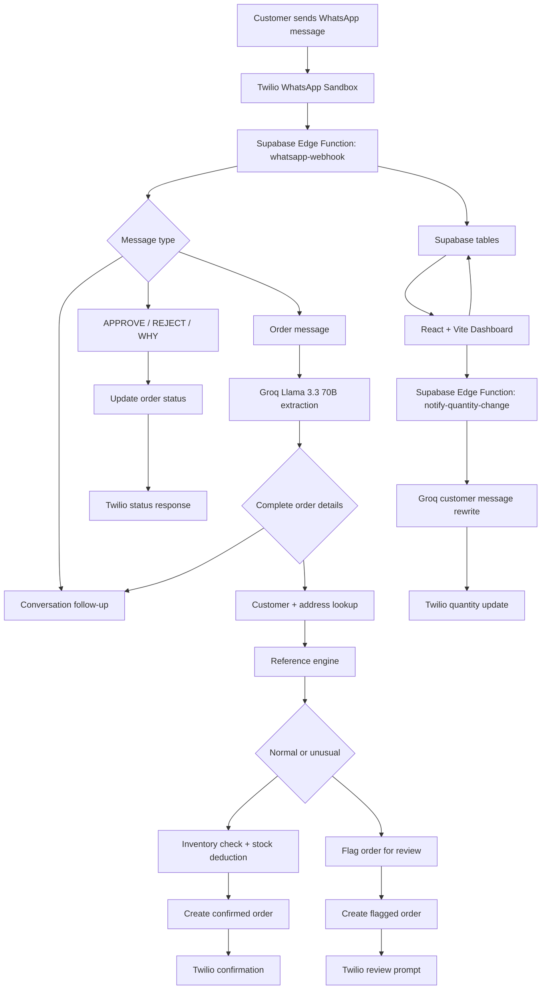

# Nudge AI

**AI-powered WhatsApp order anomaly detection that catches unusual orders before they become inventory mistakes.**

Nudge AI is a live WhatsApp ordering workflow for repeat B2B customers. It reads incoming WhatsApp orders, extracts the customer, item, quantity, and address details, checks the order against that customer's own order history, and either confirms the order immediately or routes it to a human for review.

The goal is not to replace the operator. The goal is to make sure obvious mistakes, suspicious spikes, stock issues, and quantity changes are caught before they quietly become fulfillment problems.

[Try the dashboard](https://nudge-ai-dashboard.vercel.app/)

---

## What it does

- Accepts real WhatsApp messages through Twilio WhatsApp Sandbox.
- Uses Groq Llama 3.3 70B to extract structured order details from natural language.
- Creates or updates customers from WhatsApp conversations.
- Asks for missing name, order, or address details when the message is incomplete.
- Compares each order against that customer's historical behavior for the same item.
- Confirms normal orders automatically with delivery estimates.
- Flags unusual orders for human review instead of auto-processing them.
- Supports `APPROVE`, `REJECT`, and `WHY` replies for flagged orders.
- Checks and deducts inventory before confirmation.
- Handles singular/plural inventory matches like `candle` and `candles`.
- Shows live orders, customer history, anomaly context, delivery tracking, and stock levels in the React dashboard.
- Lets operators modify quantities from the dashboard and notify the customer on WhatsApp.

---

## How it works

1. A customer joins the Twilio WhatsApp Sandbox with `join cloud-engine`.
2. They send a WhatsApp message such as `I want 10 candles`.
3. The Twilio webhook calls the Supabase Edge Function at `supabase/functions/whatsapp-webhook`.
4. The function uses Groq to extract order details, or asks a follow-up question when details are missing.
5. Nudge checks customer history and inventory.
6. Normal orders are confirmed, stock is deducted, and an estimated delivery date is saved.
7. Unusual orders are saved as flagged and the operator can approve or reject them from WhatsApp or the dashboard.
8. The React dashboard polls Supabase and updates the live feed, insights, tracking, and inventory views.

---

## Dashboard

The dashboard is built for operators who need to scan and act quickly.

- **Live Feed**: recent orders, status, anomaly reason, raw message, and quick actions.
- **Insights**: order distribution, flagged volume, highest deviation, and customer activity.
- **Tracking**: confirmed and approved orders with estimated delivery dates.
- **Inventory**: stock monitor grouped by category and sorted by lowest stock first.
- **Customer History**: per-customer order timeline and item-level quantity pattern strips.
- **Order Actions**: approve, reject, modify quantity, delete order, and notify customers.

The floating `PLACE ORDER` button opens a WhatsApp helper modal. First-time and rejoin flows prefill `join cloud-engine`; already-joined users can open WhatsApp with a starter order message.

---

## Human-in-the-loop by design

Nudge deliberately avoids full autonomous fulfillment for unusual orders.

Normal orders move fast. Suspicious orders pause.

For flagged orders, the human can reply:

- `APPROVE` - confirms the order after stock validation.
- `REJECT` - cancels the order.
- `WHY` - returns the historical quantities and average that caused the flag.

This keeps the AI in the role it is good at: noticing patterns and surfacing risk. The final decision remains with a person.

---

## Reference engine

Nudge builds its baseline from each customer's own order history.

- **First order**: saved as the initial baseline.
- **Second order**: checked against the first order for an unreasonable jump.
- **Third order onward**: compared against the rolling average for that customer and item.

Orders that are roughly above `2x` or below `0.5x` of the customer's normal quantity are flagged for review.

---

## Inventory and delivery

Before confirming an order, Nudge calls the `check_and_deduct_inventory` Postgres function.

The inventory flow:

- normalizes item names,
- handles common plural forms,
- checks available stock,
- rejects confirmation when stock is missing or insufficient,
- deducts stock when the order is confirmed or approved.

Delivery estimates are based on inventory category:

| Category | Estimate |
|---|---:|
| Groceries | 2 days |
| Toiletries | 2 days |
| Electronics | 5 days |
| Stationery | Same day |
| Other / uncategorized | 3 days |

When item pricing is available, WhatsApp confirmations include unit price and total order value.

---

## Architecture



---

## Tech stack

| Layer | Technology |
|---|---|
| Messaging | Twilio WhatsApp Sandbox |
| Backend | Supabase Edge Functions, Deno |
| Database | Supabase Postgres |
| AI extraction and rewriting | Groq, Llama 3.3 70B |
| Frontend | React, Vite, TypeScript |
| Styling | Tailwind CSS |
| Charts | Recharts |

---

## Project structure

```text
.
+-- src/
|   +-- components/
|   |   +-- OrderFeed.tsx
|   |   +-- PatternStrip.tsx
|   +-- App.tsx
|   +-- index.css
|   +-- supabaseClient.ts
+-- supabase/
|   +-- functions/
|   |   +-- whatsapp-webhook/
|   |   +-- notify-quantity-change/
|   +-- migrations/
|   +-- config.toml
+-- package.json
+-- README.md
```

---

## Environment variables

Frontend `.env`:

```bash
VITE_SUPABASE_URL=https://your-project.supabase.co
VITE_SUPABASE_ANON_KEY=your-anon-key
```

Supabase Edge Function secrets:

```bash
GROQ_API_KEY=your-groq-api-key
TWILIO_ACCOUNT_SID=your-twilio-account-sid
TWILIO_AUTH_TOKEN=your-twilio-auth-token
TWILIO_WHATSAPP_FROM=whatsapp:+14155238886
SUPABASE_URL=https://your-project.supabase.co
SUPABASE_SERVICE_ROLE_KEY=your-service-role-key
```

`TWILIO_WHATSAPP_FROM` defaults to the Twilio Sandbox sender if omitted, but setting it explicitly is recommended.

---

## Setup

1. Clone the repository.

```bash
git clone https://github.com/gowthamsrinivas2311-boop/nudge-dashboard.git
cd nudge-dashboard
```

2. Install dependencies.

```bash
npm install
```

3. Create `.env` from `.env.example` and add your Supabase frontend keys.

4. Create or link a Supabase project.

```bash
npx supabase link --project-ref your-project-ref
```

5. Apply database migrations.

```bash
npx supabase db push
```

6. Set Edge Function secrets.

```bash
npx supabase secrets set GROQ_API_KEY=...
npx supabase secrets set TWILIO_ACCOUNT_SID=...
npx supabase secrets set TWILIO_AUTH_TOKEN=...
npx supabase secrets set TWILIO_WHATSAPP_FROM=whatsapp:+14155238886
npx supabase secrets set SUPABASE_URL=https://your-project.supabase.co
npx supabase secrets set SUPABASE_SERVICE_ROLE_KEY=...
```

7. Deploy both Edge Functions.

```bash
npx supabase functions deploy whatsapp-webhook
npx supabase functions deploy notify-quantity-change
```

8. In Twilio WhatsApp Sandbox, set the inbound webhook to:

```text
https://your-project-ref.supabase.co/functions/v1/whatsapp-webhook
```

9. Run the dashboard locally.

```bash
npm run dev
```

10. Join the sandbox from WhatsApp with:

```text
join cloud-engine
```

---

## Supabase notes

The migrations in `supabase/migrations` add:

- `customers.address`
- `conversation_state` for multi-step WhatsApp flows
- `check_and_deduct_inventory(text, numeric)` for stock validation and deduction

The app expects these tables to exist in Supabase:

- `customers`
- `orders`
- `inventory`
- `conversation_state`

`customers`, `orders`, and `inventory` should include the columns selected by `src/components/OrderFeed.tsx` and the Edge Functions, including customer phone numbers, order status, estimated delivery date, item name, category, current stock, and price per unit.

---

## WhatsApp commands

| Message | Behavior |
|---|---|
| `join cloud-engine` | Joins the Twilio Sandbox |
| `I want 10 candles` | Starts or confirms an order |
| `APPROVE` | Approves the latest flagged order for that phone number |
| `REJECT` | Rejects the latest flagged order for that phone number |
| `WHY` | Explains the anomaly using historical quantities |
| Address-related messages | Lets customers view or update saved address details |

For now, customers should place one item per message.

---

## Development scripts

```bash
npm run dev
npm run build
npm run preview
```

`npm run build` runs TypeScript and creates a production Vite build.

---

## Note on WhatsApp integration

This project uses Twilio WhatsApp Sandbox for demo and testing. The sandbox makes the flow easy to try because users can join with a code, but it is not the same as a production WhatsApp Business API setup.

A production deployment would use a verified WhatsApp Business sender, production Twilio configuration, stronger auth and access control, and stricter operational logging around order changes.

---

## Built for Takeover 2026

Built July 2026 for Takeover 2026.
